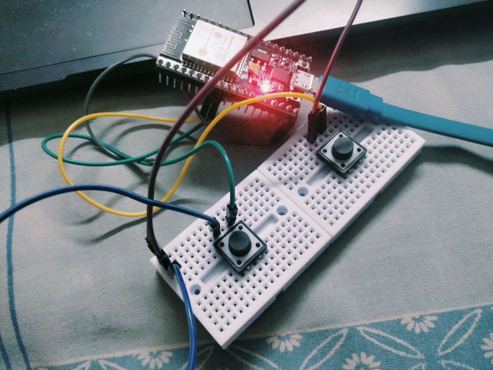
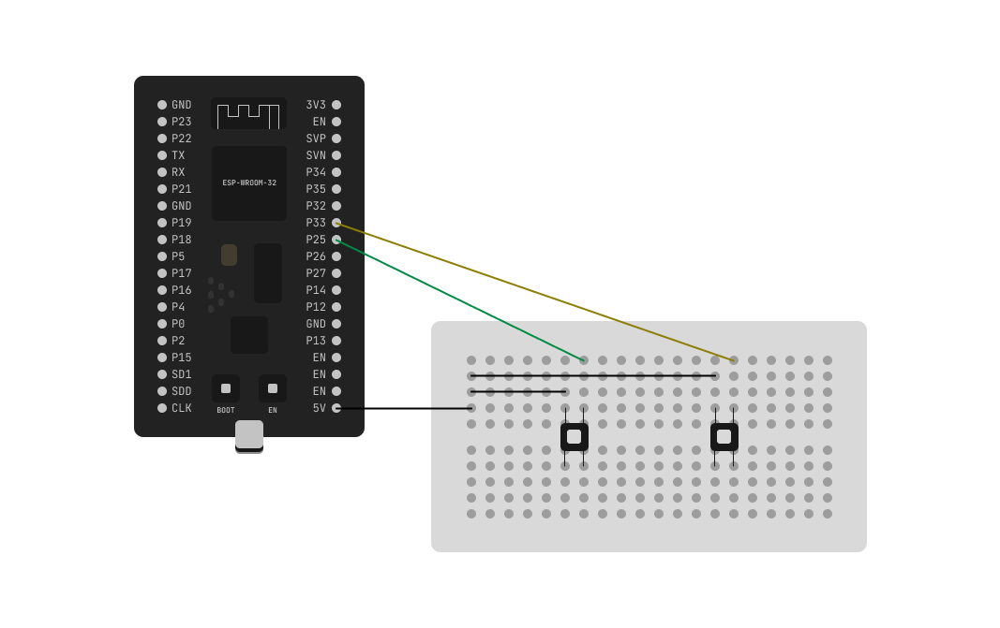

# dino controller

a dino game controller made with esp32



## building

### hardware

in terms of hardware you'll need an esp32, two push buttons, a 5 wires and a breadboard (not neccessary).



one pin of both buttons are connected to 5V. the other pin of the buttons are connected GPIO25 and GPIO33 respectively.

---

### software

upload the ```esp/esp.ino``` file to esp32. then run the ```pc/main.py```. the ```main.py``` script will convert the serial data from the buttons to space and down key.

## showcase

<video src="showcase.mp4"></video>
